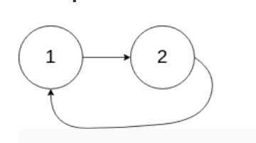

## 142. Linked List Cycle II

### 題目
Given a linked list, return the node where the cycle begins. If there is no cycle, return null.

There is a cycle in a linked list if there is some node in the list that can be reached again by continuously following the next pointer. Internally, pos is used to denote the index of the node that tail's next pointer is connected to. Note that pos is not passed as a parameter.

Notice that you should not modify the linked list.

Example 1:


```
Input: head = [3,2,0,-4], pos = 1
Output: tail connects to node index 1
Explanation: There is a cycle in the linked list, where tail connects to the second node.
```

Example 2:



```
Input: head = [1,2], pos = 0
Output: tail connects to node index 0
Explanation: There is a cycle in the linked list, where tail connects to the first node.
```

Example 3:


```
Input: head = [1], pos = -1
Output: no cycle
Explanation: There is no cycle in the linked list.
```

### 解題思路
此處與第一題的思路不同，雖都可以用runner方式解決，但我覺得用hash table比較像是日常會想到的情境，
runner解答待補

### 時間複雜度
$O(N)$

### 空間複雜度
$O(N)$
