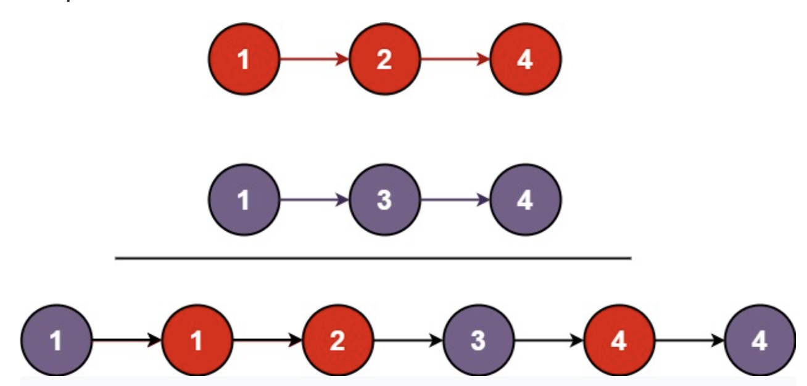

## 21.Merge Two Sorted Lists (easy)

### 題目
Merge two sorted linked lists and return it as a sorted list. The list should be made by splicing together the nodes of the first two lists.

Example 1:


```
Input: l1 = [1,2,4], l2 = [1,3,4]
Output: [1,1,2,3,4,4]
```

Example 2:
```
Input: l1 = [], l2 = []
Output: []
```

Example 3:
```
Input: l1 = [], l2 = [0]
Output: [0]
```
