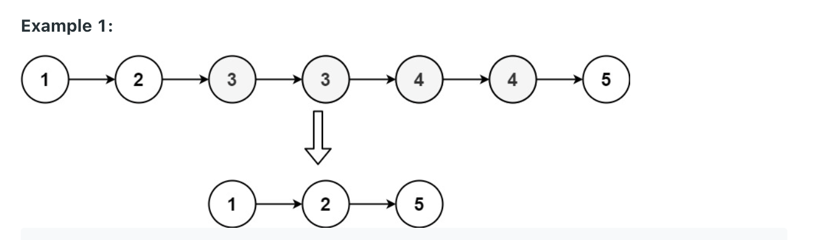
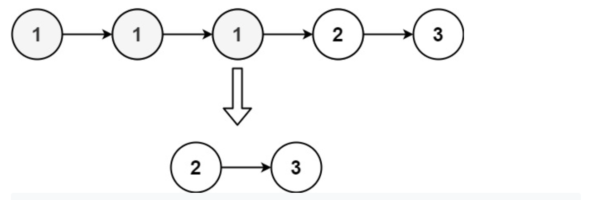

## 82.Remove Duplicates from Sorted List II (medium)

### 題目
Given the head of a sorted linked list, delete all nodes that have duplicate numbers, leaving only distinct numbers from the original list. Return the linked list sorted as well.

Example 1:


```
Input: head = [1,2,3,3,4,4,5]
Output: [1,2,5]
```

Example 2:

```
Input: head = [1,1,1,2,3]
Output: [2,3]
```

### 解題思路
建立一個第一個節點為0的新Linked-list，連結輸入的Linked-list，這邊可以從頭開始比對。
當節點的值與下一個節點的值相同，用迴圈直接跳到所有相同值的下一個節點。

### 時間複雜度
$O(N^2)$
