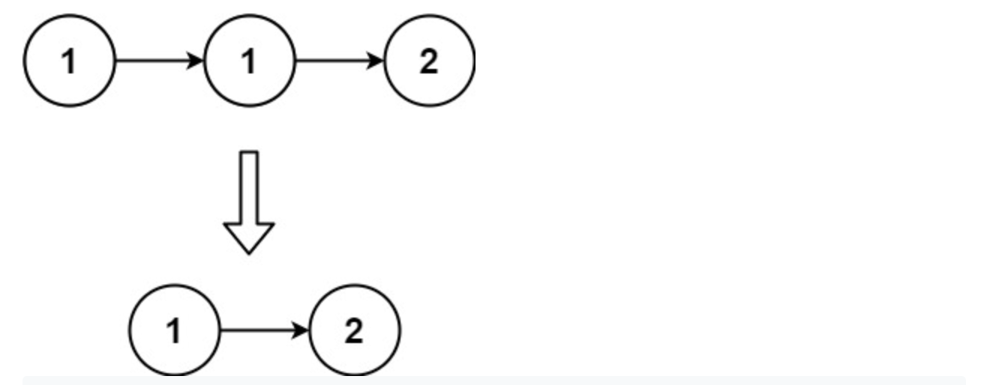
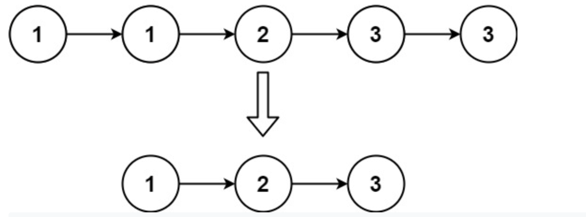

## Remove Duplicates from Sorted List (easy)

### 題目
Given the head of a sorted linked list, delete all duplicates such that each element appears only once. Return the linked list sorted as well.

Example 1:


```
Input: head = [1,1,2]
Output: [1,2]
```

Example 2:

```
Input: head = [1,1,2,3,3]
Output: [1,2,3]
```

### 解題思路
需注意，需判斷是否下一個節點為空，為了應對有[0,0,0,0]的情況。每次只應前進一個節點。

### 時間複雜度
$O(N)$
