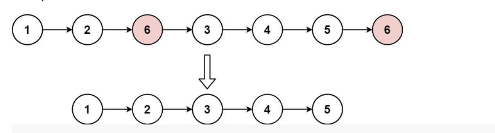

## Remove Linked List Elements (easy)

### 題目
Given the head of a linked list and an integer val, remove all the nodes of the linked list that has Node.val == val, and return the new head.

Example 1:



```
Input: head = [1,2,6,3,4,5,6], val = 6
Output: [1,2,3,4,5]
```

Example 2:

```
Input: head = [], val = 1
Output: []
```

Example 3:

```
Input: head = [7,7,7,7], val = 7
Output: []
```

### 解題思路
新建立一個空節點連接到原本的linked-list, 這樣才不會漏掉第一個值的判斷。當linked-list的下一個值等於$val時，連結當下的節點與下下一個節點。

### 時間複雜度
$O(N)$
