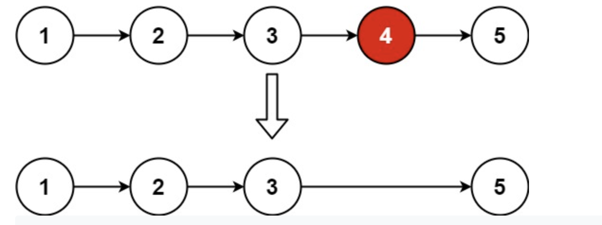

## [Remove Nth Node From End of List (medium)](https://leetcode.com/problems/remove-nth-node-from-end-of-list/)

### 題目
Given the head of a linked list, remove the nth node from the end of the list and return its head.

Example 1:



```
Input: head = [1,2,3,4,5], n = 2
Output: [1,2,3,5]
```

Example 2:

```
Input: head = [1], n = 1
Output: []
```

Example 3:

```
Input: head = [1,2], n = 1
Output: [1]
```

### 解題思路
runner方法，使快指針與慢指針的距離為n，當快指針到節點尾端時，慢指針指向的節點為需被刪除的節點。

### 時間複雜度
$O(N)$
