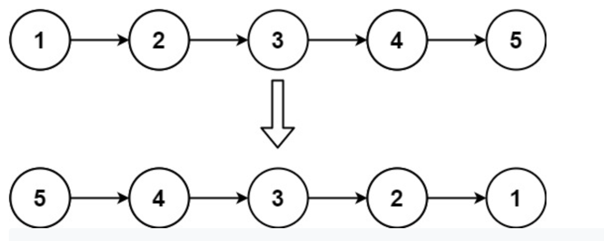

## [Remove Linked List Elements (easy)](https://leetcode.com/problems/reverse-linked-list/)

### 題目
Given the head of a singly linked list, reverse the list, and return the reversed list.

Example 1:



```
Input: head = [1,2,3,4,5]
Output: [5,4,3,2,1]
```

Example 2:

```
Input: head = [1,2]
Output: [2,1]
```

Example 3:

```
Input: head = []
Output: []
```

### 解題思路
迭代整個linked-list,按順序把節點加入新的linked-list。

### 時間複雜度
$O(N)$
